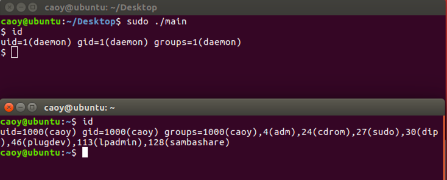

# docker_in_go
A simple implementation of docker in Golang.
The project is mostly based on https://github.com/pibigstar/go-docker
How to run ?
CGO_ENABLED=0 GOOS=linux GOARCH=amd64 go build ./main.go
After this command,you need to move <main> to Linux
1、Test hostname

2、Test PID

3、Test Mount

4、Test User

5、Test Network

6、Test IPC
